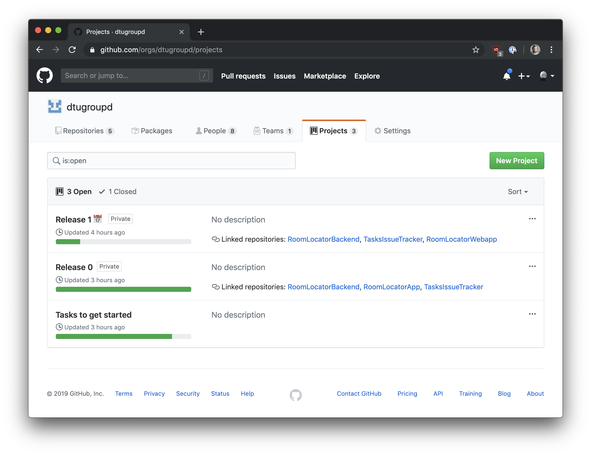
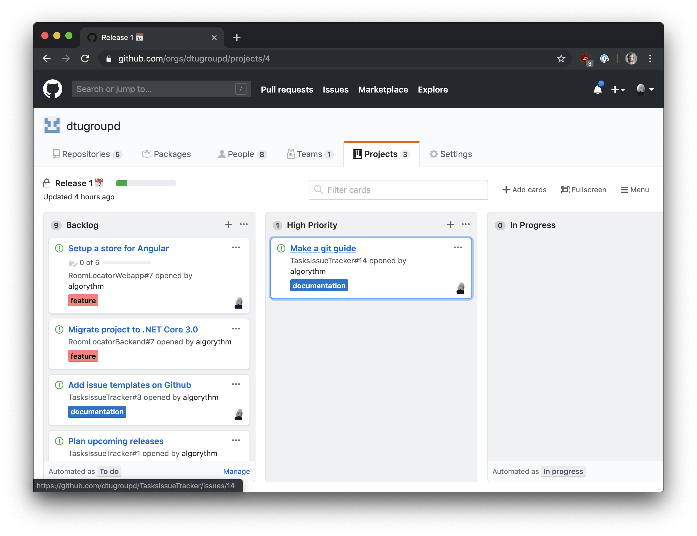
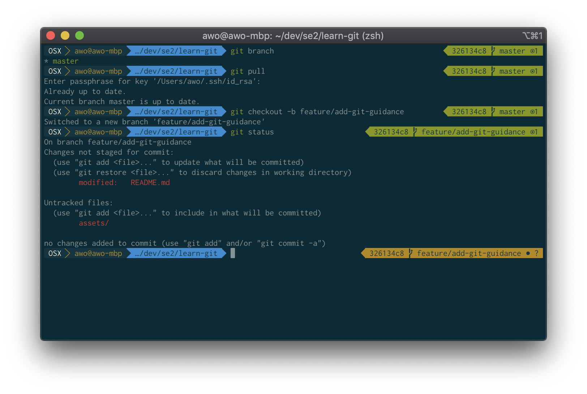
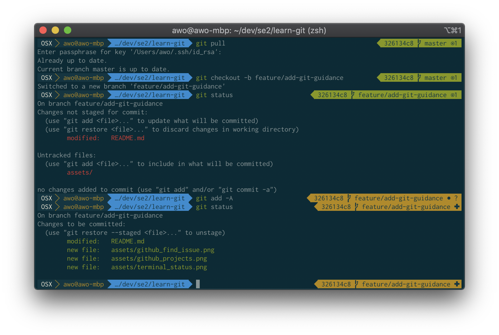
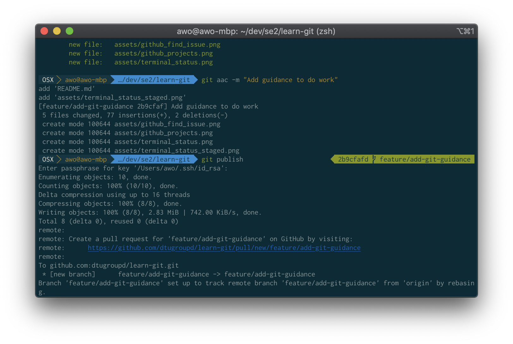
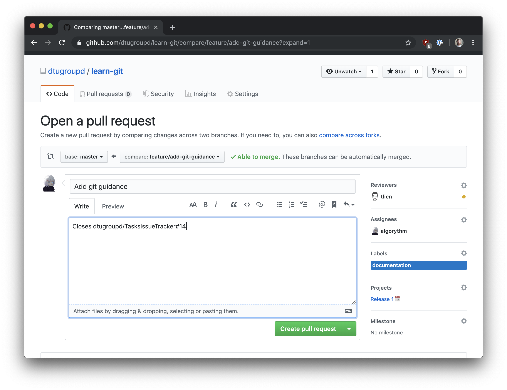
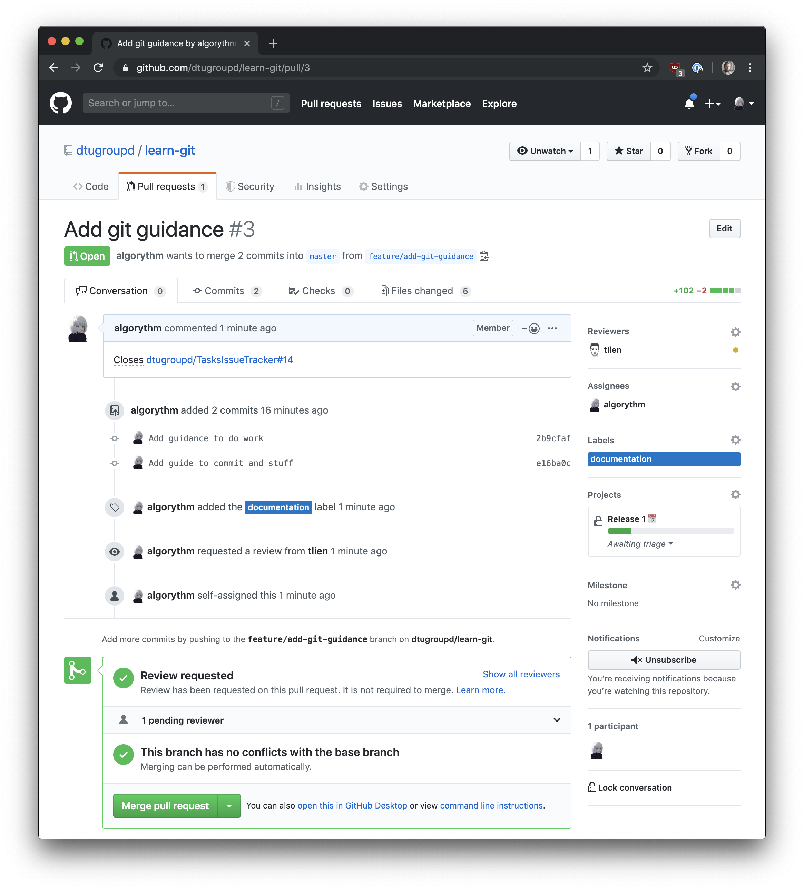

# Learn Git

This is a small guide for getting started using git. It will cover the basic CLI commands. I don't expect the reader to necessarily use the CLI for using git, though commands should be easy translatable to the corresponding buttons in the UI.

## UI's for Git

If you prefer to use a GUI for git rather than the CLI, I can highly recommend using the one built in Rider and Webstorm. If you're using another IDE/editor, such as VS Code, you can either use the built-in for the basic functions (changing branches, staging, committing etc), or download one for the following git clients:

* [Github Desktop](https://desktop.github.com)
* [Sourcetree](https://www.sourcetreeapp.com)
* [Gitkraken](https://www.gitkraken.com/git-client)

## Basic Workflow

This section describes how you can start working on a task.

### Finding a task to work on

First step is to visit the group's current project. First visit [the project page](https://github.com/orgs/dtugroupd/projects) on Github. There will be a project for each release. The project whos name ends with 📅 is the current. I.e. in the image below, `Release 1` is the current release.



Let's click on that, and find a task. Start by looking in the _High Priority_ column for a task assigned to you. If there are none, look in the _Backlog_ column. Otherwise find a task you would like to work on, and assign yourself to that issue. If someone else is on it already, coordinate with that person, to ensure you aren't making duplicate work. If you are unsure what to work on, ask someone in the group for a task.



When you picked a task, move the task to the _In Progress_ column, and start working.

### Before Working: branching

Open a terminal, or if you prefer GUI, your chosen git GUI. If you're using the terminal, cd to the directory.

You are now ready to do some work. Let's start of by making sure we are in the master branch, and that the branch is updated:

```bash
git branch
# if there isn't a * in front of master, checkout to master: git checkout master
git pull
```

Now that master is updated, we can checkout to a new branch. Generally `checkout` changes to a branch. If the branch doesn't exist (which it don't when you are starting on a new task), add the `-b` argument:

```bash
git checkout -b feature/add-git-guidance
```

We are now ready to do some actual work (code 💻)

### After Working: stage, commit, push

Let's check which files we have changed:

```bash
git status
```



We can see that files marked in <span style="color:red;">red</span> are _unstaged_. Files marked in <span style="color:green">green</span> are _staged_. Unstaged files will not be included in the commit, staged files will.

If I try to commit without having staged any files for commit, nothing will happen, as there is nothing to commit. I can add either a single file (`git add dir/file_to_stage.txt`), or everything at once (`git add -A`).

The above image shows that I have one _modified_ file and one _untracked_ directory. The modified file means that it is a file, that have previously been committed to the repository, but now have some new changes added to it. Untracked files/directories are completely new things that can be added. Let's add everything and check the status again:

```bash
git add -A
git status
```



We can not clearly see all the files that was added and modified. These files are now staged for commit, and will thus be included if I choose to commit. I can stage individual files if I want to only commit certain changes.

For committing the file, I can highly recommend to setup an editor for committing. I personally use VS Code:

```bash
git config --global core.editor "code -w"
```

We can now commit our changes:

```bash
git commit
```

This should open up VS Code, where you can now enter a descriptive commit message. Apply the commit by saving and closing the tab. If you regret commiting, don't save, just close the tab and select "Don't save".

After committing, we are ready to push. As our newly created branch does not exist on GitHub (the remote), we have to tell git to create the branch on the remote as well. We can do that with `--set-upstream` or `-u` for short. We have to specify which remote we want to create the branch on, don't worry too much about that, as it will pretty much always be _origin_, except if you intentionally called it something else:

```bash
git push --set-upstream origin feature/add-git-guidance
# or
git push -u origin feature/add-git-guidance
```

If we make more changes on this branch, we can push without specifying the upstream after committing the changes:

```bash
git push
```

After committing, we can create a pull request. You can either go to <https://github.com/:org/:repo/pull/new">, select the branch and create, or even specify the branch name <https://github.com/:org/:repo/pull/new/:branch>.

In my case it would be:

* <https://github.com/dtugroupd/learn-git/pull/new>
* <https://github.com/dtugroupd/learn-git/pull/new/feature/add-git-guidance>

The latter is even displayed in the terminal when pushing the branch. Most terminals allows for control + click on links, taking you directly to the pull request page for that branch in your default browser.



Add a descriptive message to the pull request, add a reviewer. If your pull request should close any issues, add the text "Closes #xx" where xx is the issue id for each issue that it should close in the description on the pull request. Thus the issues should automatically be closed once merged into master. If you forgot, you can add it after you created the pull request, or if the pull request was already merged, manually find the issue and close it.

Note: You can even close issues from other repositories by specifying organisation and repository name before the id (org/repo#id), i.e. `dtugroupd/TasksIssueTracker#14





Closing the issue will automatically move it to the _Acceptance Test_ column.
